# Understanding Image Degradation Analysis (IDA)

Image Degradation Analysis (IDA) is a forensic technique used to examine the underlying properties of a digital image by analyzing how its light and textures respond to heavy compression. By forcing the image to degrade, we can reveal subtle inconsistencies that may not be visible to the naked eye. This method is particularly effective at studying the physics of light within a photograph.

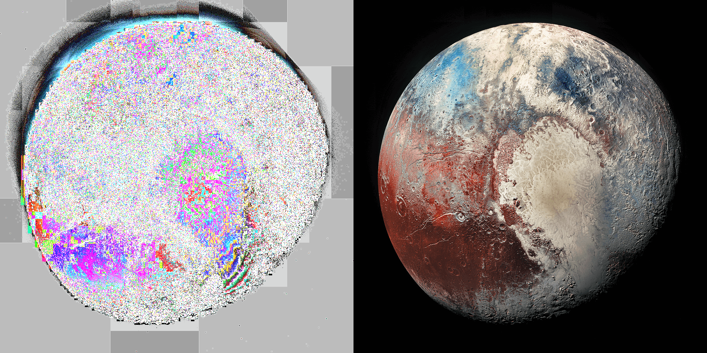

### **How Image Degradation Analysis (IDA) Works:**

The IDA process follows a specific workflow to reveal anomalies in light patterns that might not otherwise be visible.

1.  **Degradation**: A copy of the original image is saved at a very low JPEG quality with an exact setting of 5 out of 100. This step introduces consistent and significant compression artifacts which help us study the physics of light.
2.  **Comparison**: This heavily degraded image is then compared to the original version by putting it atop the original and finding the difference.
3.  **Extraction**: The difference between the two images is extracted by merging the two images together. Then an specific increase in exposure and gamma is applied to the merged image, which makes the incredibly subtle variations in light and texture exponentially more apparent.

.jpg)

The core principle is that consistent, natural light sources and uniform textures tend to degrade in predictable, uniform ways, resulting in smooth patterns. In contrast, artificial lighting, composite elements, or digitally altered areas often degrade differently, revealing sharp edges, broken patterns, and other inconsistencies.

### **How IDA Can Be Used to Study the Physics of Light:**

IDA serves as a powerful tool for studying the physics of light within a photo because light itself adheres to predictable physical laws. This technique highlights the difference between how natural and artificial light behave under stress. It has high reproducibility in many aspects such as that it can often reveal a light source's relative intensity of the objects the light htis, its directional origin, and even down to its specific type, almost like a fingerprint.

-  **Natural Light Behavior**: Natural light, especially from a distant source like the sun, scatters and diffuses in a mathematically complex but consistent way. Because the sun's rays are effectively parallel due to its vast distance, it creates a global, even illumination rather than localized points of intensity. When an image with this type of lighting is put through IDA, the degradation patterns are typically chaotic, gradual, and lack sharp, uniform shapes.

.jpg)

-  **Artificial Light Behavior**: Artificial lights, such as studio spotlights, are proximate and localized sources. They often fail to replicate the complex diffusion of sunlight,

-  **Detecting Light Intensity:** While IDA doesn't measure light in lumens, it clearly shows **relative intensity**. A strong, proximate artificial light source will produce a chaotic, harsh, multi-color blooming **hotspot**. Natural light from the sun, being more diffuse (equal light across all surfaces, not centralized,) degrades much more gradually and does not create these sharp, uniform hotspots.

.jpg)

-  **Determining Light Source Direction** The technique distinguishes between a global light source and a localized one. The sun's vast distance means its rays are effectively parallel, illuminating a scene evenly, which makes without a clear origin point makes it hard to pinpoint a direction of origin. In contrast, the presence of a distinct hotspot indicates a **localized, high-intensity source** like a spotlight. The shape and gradient of this hotspot—whether it's a perfect circle or has a sharp falloff—reveals its position relative to the camera and subject.

.jpg)

**Identifying Light "Fingerprints:"** Different types of light degrade in consistently different ways, creating a reproducible signature.

-   **Natural Sunlight**: Degrades with a turbulent, complex, and asymmetrical pattern. This signature remains consistent whether the sun is photographed from Earth, in orbit, or even through water.
        
-   **Artificial Light**: Produces geometrically uniform shapes, sharp boundaries, and a lack of the complex flare artifacts seen in natural light. Tests have shown that common light bulbs produce IDA patterns that are distinctly different from the sun's signature.

This consistency allows an analyst to compare the "fingerprint" from an unknown light source in a photograph to a library of known sources, helping to determine its authenticity.

.jpg)

---

## Grid Analysis: Visualizing Degradation Patterns

A **Grid Analysis** is one of the most powerful features of the tool. Instead of running a single analysis, it processes the image ten times, using the current **Factor (m)** that is set while sweeping the **Degradation (x)** value from 1 to 10.

This creates a 2x5 grid of results, allowing you to see how the patterns evolve as the compression becomes more intense. It's an excellent way to understand the stability and consistency of the light sources and textures within the scene. The images below were all generated using this feature.

.png)

## Exploring the Analysis Tool's Features

Beyond the standard Grid Analysis, the tool offers a suite of advanced options to fine-tune your investigation.

### Main Settings
* **Analysis Mode**:
    * **IDA (Image Degradation Analysis)**: The primary mode, which uses heavy degradation (low quality) to analyze the physical properties of light and texture.
    * **ELA (Error Level Analysis)**: A classic technique that saves the image at a high quality to reveal differences in compression levels across the image, often used to detect edits from a different source.
    * **Hybrid**: A mode that combines the results of IDA and ELA to produce a unique visualization, highlighting areas where both methods detect anomalies.
    * **Double Exposure**: An experimental mode that runs an IDA pass on the result of a previous IDA pass, which can sometimes amplify very subtle effects.
* **Factor (m)**: Controls the amplification (exposure/gamma) of the final difference map. A higher value makes subtle details brighter. The IDA standard is 4.
* **Degradation (x)**: The strength of the degradation step in IDA. A lower value means more extreme compression. The IDA standard is 5. IDA only uses values from 1 through 10, while ELA typically uses 85-95.

### Channel & Sub-Analysis
* **Channel Mode**: Changes how the final result is visualized.
    * **Luminescence**: A grayscale view showing the average difference across all channels.
    * **Inverted**: Inverts the colors of the Standard view.
    * **Heatmap**: Maps the intensity of the difference to a color gradient, from blue (low) to red (high).
    * **Threshold**: A black-and-white view where pixels with a difference above a certain threshold are shown as white, and all others are black.
* **Sub-Analysis Mode**: Applies a secondary analysis technique.
    * **None**: The standard analysis.
    * **Q-Curve**: Creates an RGB image where each channel represents the result from a different JPEG quality level, revealing how degradation changes at different compression strengths.
    * **Iterative**: Compresses the image multiple times with different qualities before comparing it to the original, useful for spotting resilient patterns.
    * **Edge Analysis**: First runs an edge detection filter on the image and then performs the IDA/ELA analysis on the edges, isolating object boundaries.
    * **Chroma Analysis**: Isolates and enhances color-only (chrominance) differences, which can help detect color manipulation or artifacts from chroma subsampling.

---

## Frequently Asked Questions (FAQ)

#### How is IDA different from ELA?
**ELA** uses *high* quality compression (e.g., 95%) to spot differences in the image's compression history. It's good for finding an object that was saved at a different quality level before being pasted in.
**IDA** uses *very low* quality compression to analyze how the image's physical content (light and texture) *reacts* to degradation.

#### Can IDA prove an image is fake?
**No.** No single tool can definitively prove a forgery. IDA is an investigative tool that highlights data inconsistencies that are otherwise invisible. An unusual result is not proof of a fake but is a strong indicator that a specific area of the image is anomalous and requires closer inspection. The more photos analyzed of a scene that there are, then a greater confidence level can be obtained.

## IDA Grid Examples of the Sun

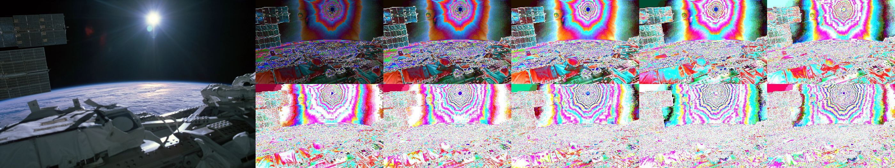
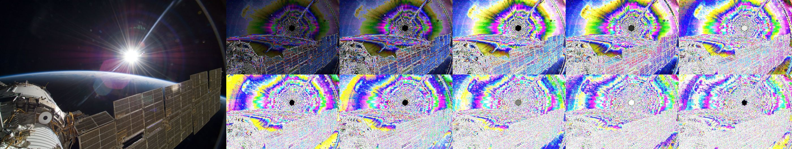
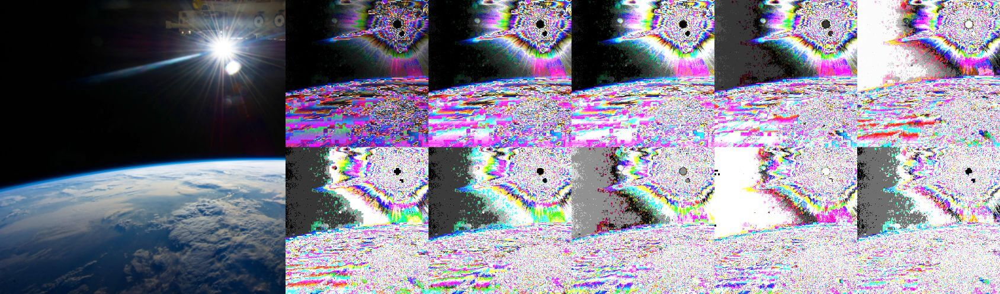
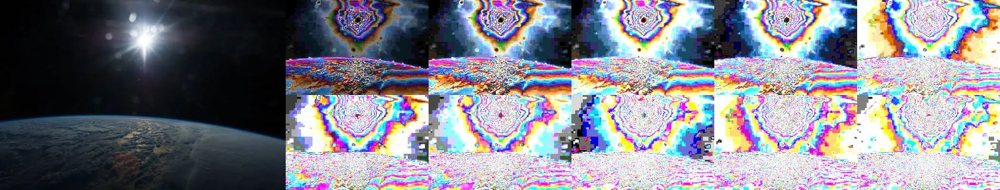
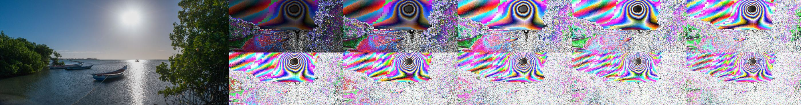
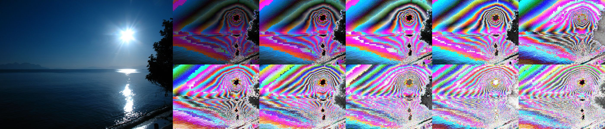
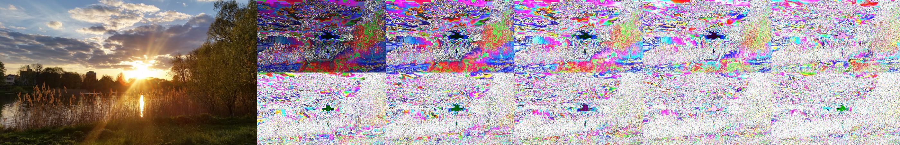
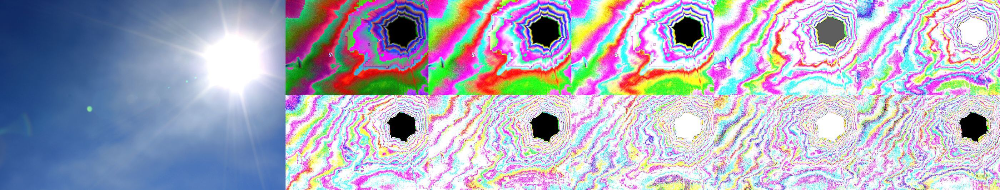
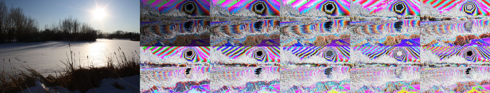
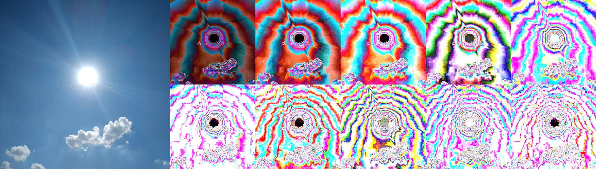
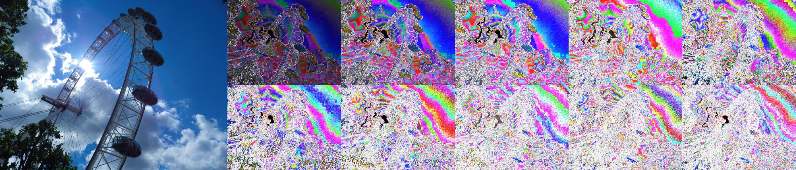
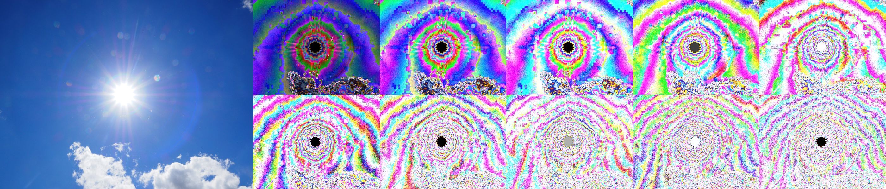
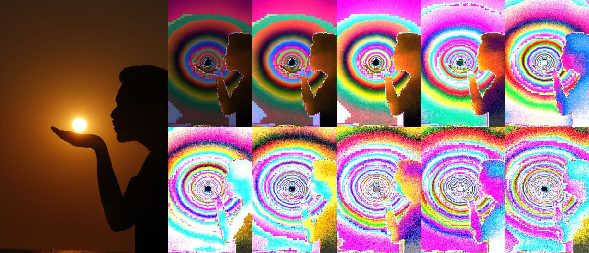
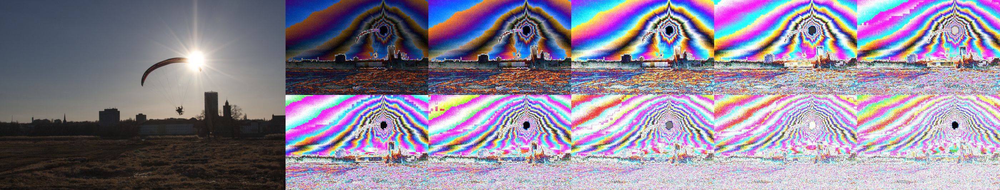
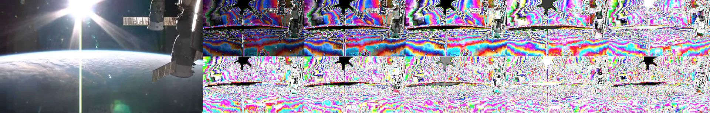
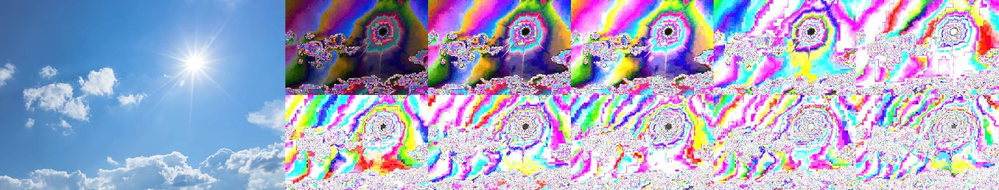
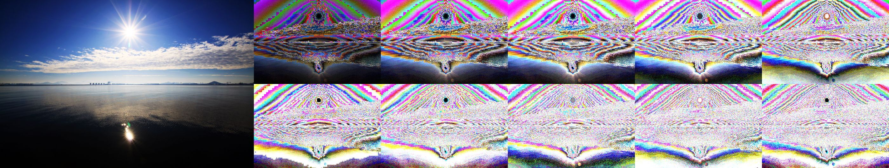
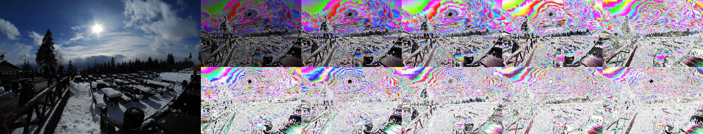
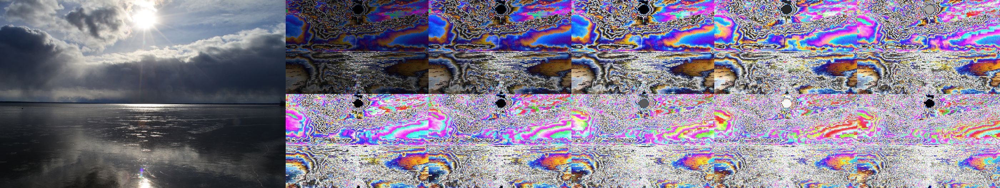
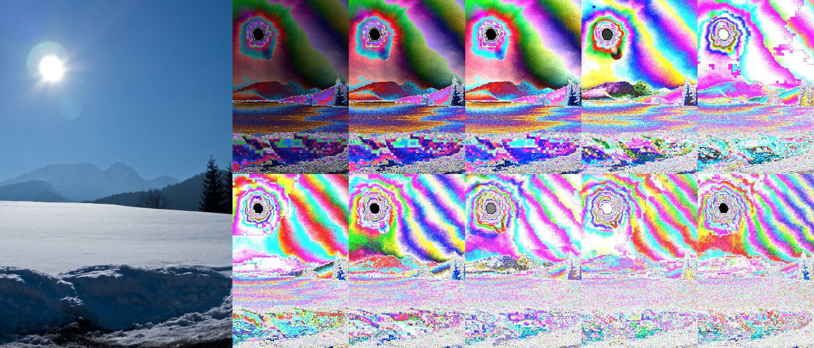
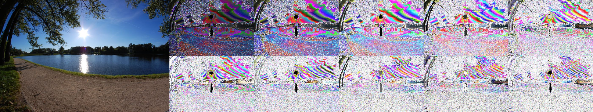
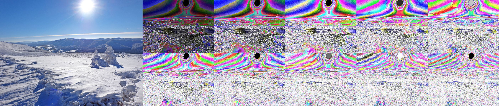
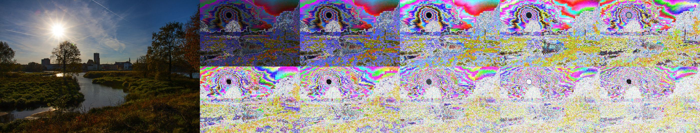
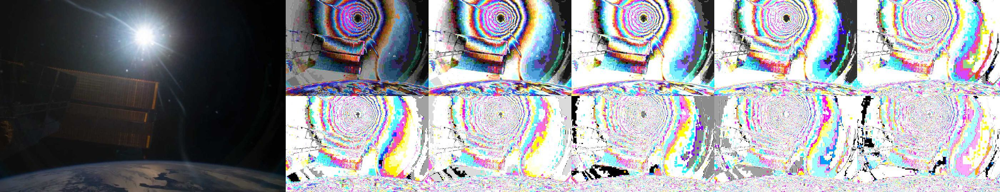
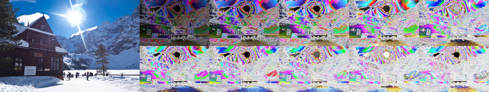
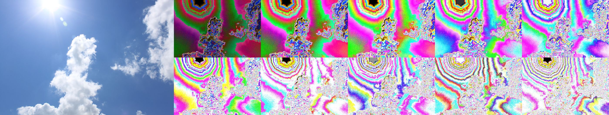

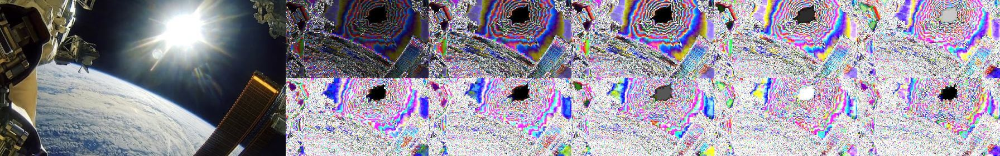
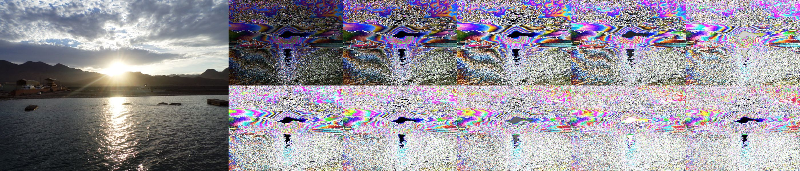
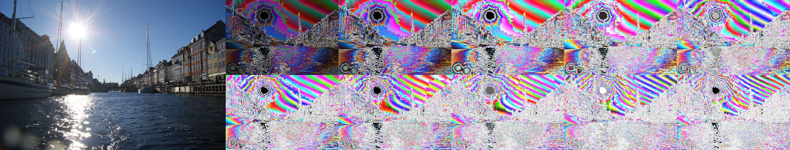
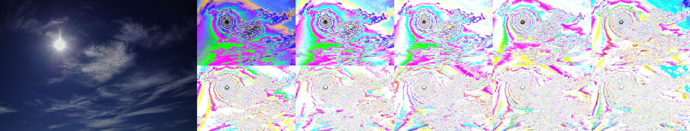
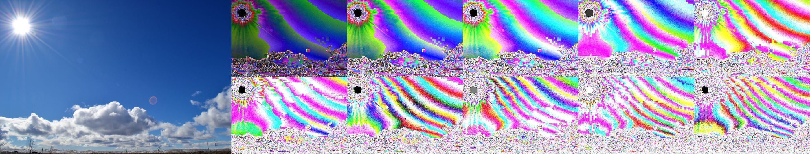
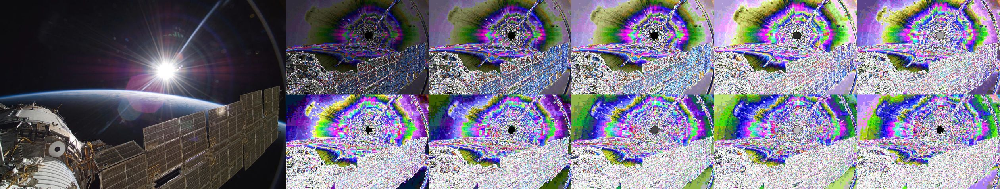
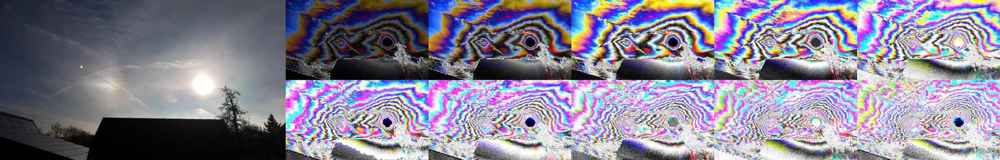
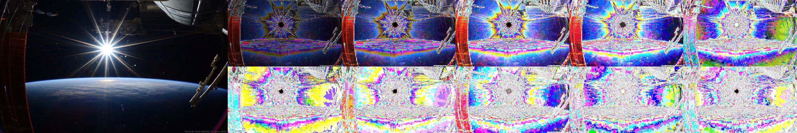
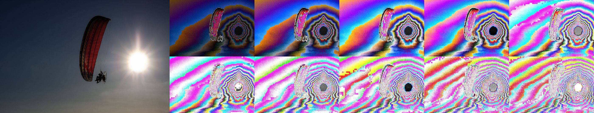
